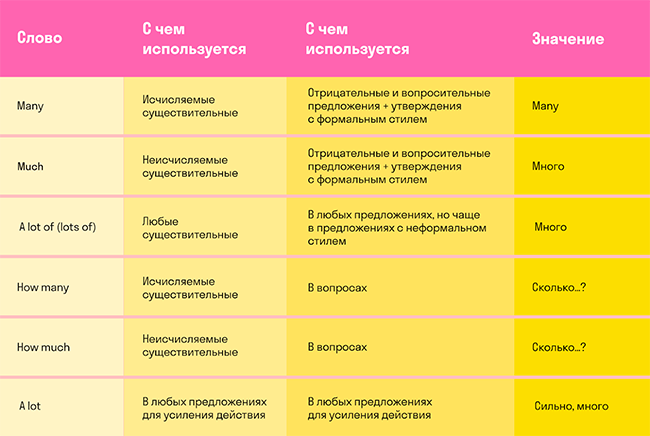

# Rules
* [Many / Mach / A lof of]()

## Many / Mach / A lof of
В английском все три слова **much**, **many** и **a lot of** называют **quantifiers**, от слова quantity — количество. 
### Much
**Much** используем исключительно в предложение перед неисчисляемыми существительными.

* `She'd better hurry, we do not have much food left.` — Ей бы лучше поторопиться, у нас осталось не так уж и много еды. 

* `My sister does not have much time to finish her exam.` — У моей сестры недостаточно времени, чтобы закончить экзамен. 

* `There is too much wind to have a bonfire tonight.` - Сегодня слишком сильный ветер, чтобы разводить костер.

Можно встретить и такие предложения, в которых **much** играет роль местоимения-существительного:

`Much is yet to be done.` — Многое еще предстоит сделать. 

### Many
**Many** это то наречие используется только с исчисляемыми существительными.  

* `There are too many mosquitos to have a bonfire tonight.` - Сегодня слишком много комаров, чтобы сиднть у костра.

* `There aren’t many women in this room.` — В этой комнате не много женщин.

Как и в случае с many, much может использоваться как местоимение-существительное:

`Many have not yet left the building.` — Многие еще не покинули здание.

### Many of, much of 

* `Many of my friends have not yet become parents.` — **Многие из** моих друзей еще не стали родителями. 
* `Much of my love for him has disappeared.` — **Большая часть** моей любви к нему исчезла. 

### A lot of
**A lot of** — это универсальное наречие, которое вы можете употребить в предложении, где используются оба типа существительных.

**!!!** Но стоит запомнить, что оно употребляется только в утвердительных предложениях.

* `I have visited a lot of doctors but nobody can tell me what is wrong.` — Я посетил множество врачей, но никто не может мне сказать, что со мной не так.

* `Sasha has a lot of magnificent dresses in her wardrobe.` — У Саши в гардеробе много потрясающих платьев. 

### Lots of 
Хотите еще больше неформальности и легкости в вашей речи? Смело используйте **lots of** — эквивалент **a lot of**. Его разрешается использовать в любом контексте и с любым существительным: 

* `We had lots of friends at our party.` — У нас на вечеринке была куча друзей.

* `She did not have lots of time to spare.` — У нее не было много свободного времени. 

### A lot 
В отличие от своего собрата с предлогом **of**, **a lot** используется только в связке с глаголами для усиления значения: 

* `She likes him a lot.` — Он ей сильно нравится.

* `They drove a lot last night.` — Они много проехали вчера ночью. 

### How much or How many
Эти две фразы, которые означают «**сколько?**», работают по тому же принципу, как и одиночные **many** и **much**. 

Правило простое: определите, какое перед вами существительное и, если оно исчисляемое, используйте how many:

* `How many boxes of vegetables do you sell per day?` — Сколько коробок овощей вы продаете за день?

Если же перед вами неисчисляемое существительное — вы уже знаете, что нужно использовать how much:

* `How much water do you drink in one day?` — Сколько воды ты выпиваешь за день? 

### Другие случаи использования much
Существует еще два варианта использования **much** — давайте их рассмотрим:

В сочетании с **very** («очень»), **too** («слишком») или **so** («так») в значении «сильно» или «много»:

* `I love you very much!` — Я тебя очень люблю!
* `I love you too much!` — Я слишком сильно тебя люблю!
* `I love you so much!` → Я люблю тебя так сильно! 

### 

## 